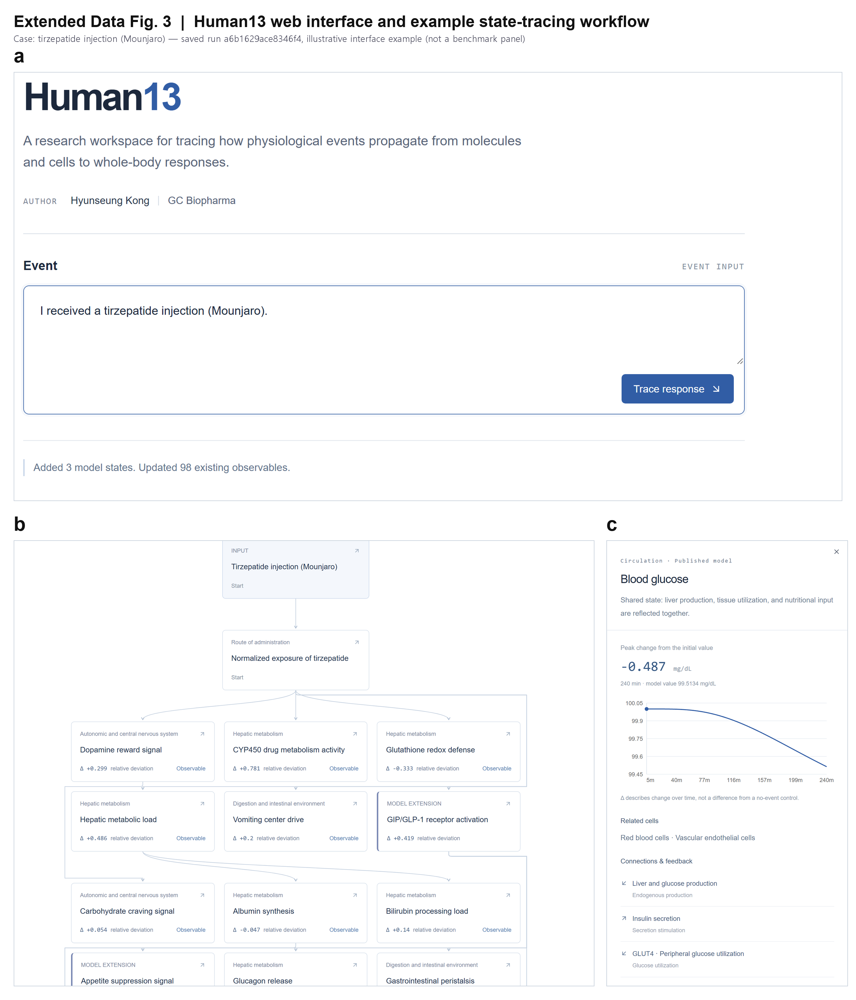

# Human13

**A physiological digital twin for simulating interventions and inferring unobserved states.**

Human13 connects an intervention's initial action to interacting physiological
processes, and updates that representation with observations. It represents
**205 reduced states across 19 physiological systems**, so that researchers can
simulate intervention responses, infer unmeasured internal states, and forecast
their evolution after observations stop.

> Research software. Model outputs are relative functional deviations used for
> exploring coupled processes — they are not clinical predictions, measured
> concentrations, or medical advice.



## What it does

- **Natural-language or structured event input** — physiological events
  (exercise, meals, posture change, haemorrhage) and chemical/drug inputs are
  interpreted into structured event records.
- **Molecular grounding of drug inputs** — cached compound identity and target
  records (ChEMBL activities/mechanisms, PubChem identity) are canonicalized and
  mapped to target-specific physiological input terms; record selection
  prioritizes Ki/Kd over IC50 over EC50, with provenance retained.
- **Coupled propagation** — a shared integration kernel advances the reduced
  physiological library together with native cardiovascular, metabolic and
  exposure variables; bounded targets keep reduced states in [-3, 3].
- **Observation-driven state estimation** — held measurements update selected
  coordinates (continuous nudging, single-update jump, EnKF), supporting
  inference of unmeasured hidden states and post-cutoff forecasting.
- **Inspectable web workspace** — a response-pathway graph distinguishes
  observed (`Observable`) from model-extension (`MODEL EXTENSION`) states, and a
  per-state detail view shows the simulated trajectory, peak change, connected
  nodes and evidence.

## Key findings (validation v4)

| Experiment | Result |
|---|---|
| Haemorrhage forecast, 120 min cutoff | Observed RMSE −49.3%, hidden RMSE −36.8% with nudging |
| Observation panel placement | Upstream panel −36.7% hidden RMSE vs matched downstream panel |
| Coupling ablation | Hidden-state benefit of updating disappears when represented connections are removed (paired Δ −0.0606) |
| Drug inputs (furosemide/propranolol, 2×2) | Observations recover ~49.5% of a withheld drug response; with exact input they add noise instead |

All headline numbers are regenerable from the frozen per-trial CSVs and raw
`.npz` artifacts — see `benchmark/` and `benchmark/VALIDATION.md`.

## Repository layout

```
backend/     FastAPI backend: physiological library, ODE kernel, drug-target
             mapping, exposure model, event interpretation, analysis APIs
web/         Web workspace (vinext/React/TypeScript): event entry, pathway
             graph, per-state detail, evidence reports
benchmark/   Evaluation scripts and frozen experiment definitions
             (E2 forecast, E3 coupling, E4 observation panels, E5 drug inputs,
             internal/external/holdout scenario suites, PRCP posture data)
tests/       Pytest suite (131 tests)
paper/       Manuscript source, tables and figure scripts
figures/     Figure assets, including the Extended Data Fig. 3 UI captures
scripts/     Smoke checks and maintenance utilities
```

## Requirements

- Python 3.12 (`requirements.lock.txt`)
- Node.js 22.13+ (web workspace)
- An [OpenRouter](https://openrouter.ai) API key for language-interpretation
  calls (drug/target retrieval uses public databases; cached results need no
  key)

## Quick start (Windows)

```powershell
uv venv --python 3.12 .venv
uv pip sync --python .venv\Scripts\python.exe requirements.lock.txt
Copy-Item .env.example .env   # then set OPENROUTER_API_KEY
cd web; npm ci --include=dev --include=optional; cd ..
.\start.ps1                    # serves http://localhost:5173 + API on :8000
```

`stop.ps1` stops only the processes started by `start.ps1`. The backend binds
to loopback only; event text and substance identifiers are sent to OpenRouter
and public databases, and the API key stays in `.env` (never bundled or logged).

## Reproducing the evaluations

```powershell
pytest tests/ -q                                  # unit + regression suite
python benchmark/evaluate.py                      # internal scenario suite
python benchmark/aggregate_v4.py                  # rebuild result tables from raw artifacts
```

The frozen v4 experiment package (raw trajectories, per-trial CSVs, bootstrap
intervals, provenance manifest) accompanies the manuscript as a source-data
archive. Within it, run identifiers are unique across truth, observation,
parameter and trajectory artifacts, and result tables regenerate from raw
artifacts alone via `benchmark/aggregate_v4.py`.

## Documentation

- [benchmark/VALIDATION.md](benchmark/VALIDATION.md) — benchmark definitions and result regeneration
- [backend/models/README.md](backend/models/README.md) — fixed-model sources and reproduction scope
- [figures/ui/FIGURE_SOURCE.md](figures/ui/FIGURE_SOURCE.md) — UI figure provenance and capture conditions

## Author

Anonymous authors
Paper under double-blind review

## License

MIT — see [LICENSE](LICENSE).
